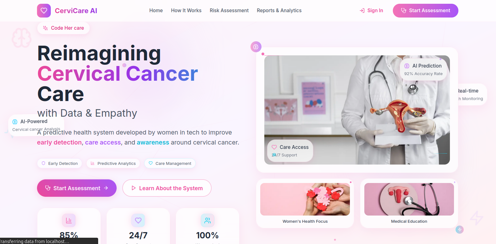

# CervAi


**Empowering Women’s Health Through Technology**

---

## 🌸 What is CervAi?

CervAi is a web platform designed to support women in taking charge of their cervical health. Our mission is to make cervical cancer awareness, screening, and support accessible, friendly, and community-driven.

---

## ✨ Key Features (Planned & In Progress)

- **Personalized User Dashboard:**  
  Every woman gets her own dashboard to track her health journey, see past assessments, and access resources.

- **Comprehensive Assessment Form:**  
  Our assessment form goes beyond basic questions—it asks about your symptoms, risk factors, and health history to provide tailored recommendations.

- **Reminders & Scheduling:**  
  Never miss a screening! Schedule reminders for your next test or checkup, and get gentle nudges when it’s time.

- **Supportive Community:**  
  Join a safe, welcoming community of women—whether you’re living with cervical cancer, a survivor, or simply proactive about your health. Share experiences, ask questions, and support each other.

- **AI Chatbot:**  
  Have questions or need someone to talk to? Our friendly chatbot is here 24/7 to answer your questions, provide information, or just chat.

---

## 👩‍💻 Who is This For?

- Women of all ages who want to take charge of their cervical health.
- Anyone seeking information, support, or reminders about cervical cancer screening.
- Community members, survivors, and supporters.

---

## 🚀 Getting Started

> **Note:** The platform is under active development. Some features are prototypes or coming soon!

### 1. Try the Frontend Locally

```bash
cd my-frontend
npm install
npm run dev
```

Open [http://localhost:3000](http://localhost:3000) in your browser.

### 2. Explore the Features

- Fill out the assessment form (with symptom questions!).
- Set up a reminder for your next screening.
- Join the community (coming soon).
- Chat with our AI assistant (coming soon).

---

## 🛣️ Roadmap

- [x] User dashboard for women
- [x] Assessment form with symptom questions
- [ ] Reminders & scheduling
- [ ] Community forum & support groups
- [ ] AI-powered chatbot
- [ ] Mobile-friendly design

---

## 🤝 Contributing

We welcome contributions! Whether you’re a developer, designer, health professional, or advocate, your input is valued. Please open an issue or pull request to get started.

---

## ❤️ Our Vision

We believe every woman deserves access to information, support, and tools to protect her health. CervAi is built by women, for women—join us on this journey!

---

## 📸 Sneak Peek

  
*Your health, your community, your care.*

---
